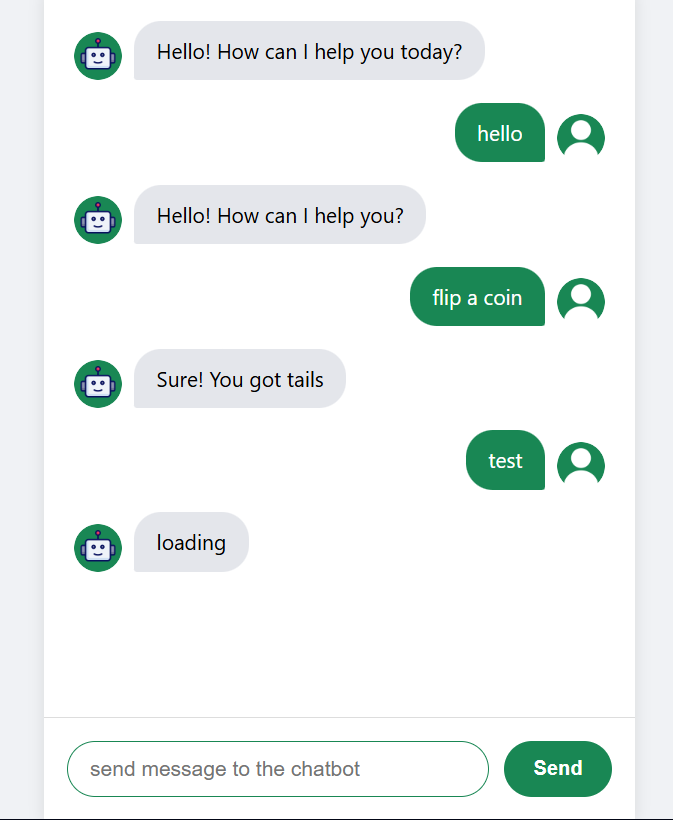

# 📱 React Chatbot

A **simple React chatbot project** for learning and experimenting with building conversational UIs.  
It allows users to send messages and receive responses from a simulated bot.  
This project is perfect for practicing **React Hooks**, **state management**, and **modular components**.

> This repository is intended for learning and demonstration purposes.

---

## 🖼 Demo


Here’s what the chatbot looks like in action:

 

---

## 🚀 Features

- 💬 Interactive chat interface built with React  
- 🧠 Simulated bot responses  
- 🖼 Display of user and bot avatars  
- 🧹 Auto-scroll to the latest message  
- 🛠 Simple, educational codebase for beginner React developers

---

## 📁 Project Structure


chatbot-project/
├── src/
│ ├── components/
│ │ ├── chatinput.jsx
│ │ ├── chatMessage.jsx
│ │ └── usermessage.jsx
│ ├── assets/
│ │ ├── robot.png
│ │ └── user.png
│ ├── App.jsx
│ └── main.jsx
├── public/
├── package.json
├── vite.config.js
└── README.md


---

## 🧩 Installation

Clone the repository and install dependencies:

```bash
git clone https://github.com/tarek-brahimi/chatbot.git
cd chatbot/chatbot-project
npm install
▶️ Run Locally

Start the development server:

npm run dev

Open your browser:

http://localhost:5173
🧠 How It Works

App.jsx: main layout and chat state management

ChatMessage.jsx: renders all messages and scrolls automatically

ChatbotInput.jsx: handles user input and bot responses

Images: display user and bot avatars
📦 Dependencies

React – UI library

Vite – Fast development tooling

supersimpledev – Helper for bot responses

📄 License

This project is open-source and free to use.